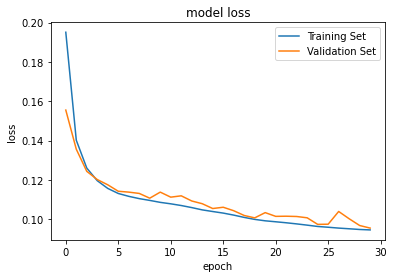
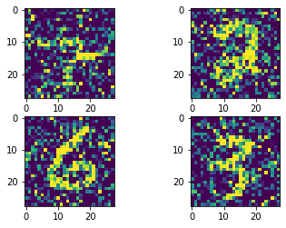

# Auto-encoder_in-Mnist

使用Mnist做Auto-encoder，目的: 學習基本Auto-encoder技巧，以下內容包括:

- AE
- De-noising AE

Medium: https://yellowgirl3614.medium.com/autoencoder-inmnist-acb3822779e6

reference from: https://www.kaggle.com/irawatt/mnist-digits-stacked-autoencoder-implementation

### 使用Autoencoder


from: 
1. AutoEncoder (一)-認識與理解: https://medium.com/%E7%A8%8B%E5%BC%8F%E5%B7%A5%E4%BD%9C%E7%B4%A1/autoencoder-%E4%B8%80-%E8%AA%8D%E8%AD%98%E8%88%87%E7%90%86%E8%A7%A3-725854ab25e8

2. ML Lecture 16: Unsupervised Learning - Auto-encoder
https://www.youtube.com/watch?v=Tk5B4seA-AU&list=PLJV_el3uVTsPy9oCRY30oBPNLCo89yu49&index=27


```python
import numpy as np # linear algebra
import pandas as pd # data processing, CSV file I/O (e.g. pd.read_csv)
import matplotlib.pyplot as plt
from matplotlib.image import imread
from sklearn.manifold import TSNE
import tensorflow as tf
from tensorflow.keras import layers
import keras
from keras import backend as K

import os
for dirname, _, filenames in os.walk('/kaggle/input'):
    for filename in filenames:
        print(os.path.join(dirname, filename))
```

    /kaggle/input/digit-recognizer/sample_submission.csv
    /kaggle/input/digit-recognizer/train.csv
    /kaggle/input/digit-recognizer/test.csv


```python
training_path = "/kaggle/input/digit-recognizer/train.csv"
testing_path = "/kaggle/input/digit-recognizer/test.csv"

epoch = 30
```


```python
#Download Data
digitMNIST = pd.read_csv(training_path)
traindata, valdata = digitMNIST[5000:], digitMNIST[:5000]
print(traindata.shape)
```

    (37000, 785)
    


```python
y_train, x_train = traindata['label'], traindata.drop('label', axis=1)
y_val, x_val = valdata['label'], valdata.drop('label', axis=1)


x_train = x_train/255
x_val = x_val/255

x_train = tf.reshape(x_train, [37000, 28, 28])
x_val = tf.reshape(x_val, [5000, 28, 28])
```

### selu
Selu 理論與應用: 
https://hackmd.io/@pSnFKx_GTlmTWXn4A8lpKw/Hk-5MUbyr?type=view

Hung-yi Lee: https://www.youtube.com/watch?v=1WPjVpwJ88I&list=PLJV_el3uVTsPMxPbjeX7PicgWbY7F8wW9&index=12

從relu開始，激活函式不斷突破，依序發展為: relu -> leaky relu -> elu -> selu。


ELU差異在小於0的地方，假設z=0，α=0，z=趨近於-∞，α=-α


SELU會放大input (乘上λ)


```python
#Autoencoder topology  
Stacked_encoder = keras.models.Sequential([
    keras.layers.Flatten(input_shape = [28,28]),
    keras.layers.Dense(100,activation="selu"),
    keras.layers.Dense(30,activation="selu"),
])

Stacked_decoder = keras.models.Sequential([
    keras.layers.Dense(100,activation="selu",input_shape=[30]),
    keras.layers.Dense(28*28, activation="sigmoid"),
    keras.layers.Reshape([28,28])
])
model = keras.models.Sequential([Stacked_encoder,Stacked_decoder])

model.summary()

model.compile(loss="binary_crossentropy",
              optimizer=keras.optimizers.SGD(lr=1.5))
```

    Model: "sequential_2"
    _________________________________________________________________
    Layer (type)                 Output Shape              Param #   
    =================================================================
    sequential (Sequential)      (None, 30)                81530     
    _________________________________________________________________
    sequential_1 (Sequential)    (None, 28, 28)            82284     
    =================================================================
    Total params: 163,814
    Trainable params: 163,814
    Non-trainable params: 0
    _________________________________________________________________
    

### 解釋為何model.fit時都是x_train,x_train?
fit的第一和第二個參數以往是放x_train, y_train
- 第一個para放的是: input
- 第二個para放的是: output要跟甚麼比較算loss

所以如下，input是x_train，經過encoder和decoder後的output要跟原本的圖做比較算loss，所以都是x_train,x_train


如果有加noise (Denoising AE, ex: https://ithelp.ithome.com.tw/articles/10207148)
input即是x_train_noisy(加了noise的x_train),第二個參數則是x_train (還是和原圖比)


```python
history= model.fit(x_train,x_train,
                   epochs=epoch, 
                   validation_data = (x_val, x_val), verbose=0)
```


```python
#Visualise training process
plt.plot(history.history['loss'])
plt.plot(history.history['val_loss'])
plt.title('model loss')
plt.ylabel('loss')
plt.xlabel('epoch')
plt.legend(['Training Set', 'Validation Set'], loc='upper right')
plt.show()
```





```python
#Encode a sample of the test data
test = pd.read_csv(testing_path)
testPics = tf.convert_to_tensor((test/255))
testPics = tf.reshape(testPics, [28000, 28, 28])
result = model.predict(testPics[:10])
```


```python
# 經過auto-encoder得到的result
for i in range(1,10):
    plt.subplot(2,5, i)
    plt.imshow(result[i]*255)
```


```python
# 原圖
for i in range(1,10):
    plt.subplot(2,5, i)
    plt.imshow(testPics[i]*255)
```


```python
#Visualise the test image and its encoded&decoded representation
fig, axs = plt.subplots(nrows=1, ncols=2)
axs[0].imshow(testPics[0]*255,  vmin=0, vmax=255,)
axs[0].title.set_text("Origional")
axs[1].imshow(result[0]*255,  vmin=0, vmax=255)
axs[1].title.set_text("Encoded and Decoded")
```


```python
#Show how each digit looks broken down to two dimentions
xCompressed = model.predict(x_val)
tsne = TSNE()
xCompressed = tf.convert_to_tensor(xCompressed)
xCompressed = tf.reshape(xCompressed, [5000, 784])
xCompressed2D = tsne.fit_transform(xCompressed)

plt.figure(figsize=(10,10))
plt.scatter(xCompressed2D[:,0],xCompressed2D[:,1],c = y_val, s=10, cmap= 'tab10')
plt.axis("off")

#Add ledgend
for i in range(10):
    plt.plot(0,0,'o',label = i, ) 
plt.legend()
plt.show()
```


### De-noising AE


```python
# This Python 3 environment comes with many helpful analytics libraries installed
# It is defined by the kaggle/python Docker image: https://github.com/kaggle/docker-python
# For example, here's several helpful packages to load

import numpy as np # linear algebra
import pandas as pd # data processing, CSV file I/O (e.g. pd.read_csv)

# Input data files are available in the read-only "../input/" directory
# For example, running this (by clicking run or pressing Shift+Enter) will list all files under the input directory

import os
for dirname, _, filenames in os.walk('/kaggle/input'):
    for filename in filenames:
        print(os.path.join(dirname, filename))

# You can write up to 20GB to the current directory (/kaggle/working/) that gets preserved as output when you create a version using "Save & Run All" 
# You can also write temporary files to /kaggle/temp/, but they won't be saved outside of the current session
```

    /kaggle/input/digit-recognizer/sample_submission.csv
    /kaggle/input/digit-recognizer/train.csv
    /kaggle/input/digit-recognizer/test.csv
    


```python
import numpy as np
import matplotlib.pyplot as plt
from matplotlib.image import imread
import pandas as pd
from sklearn.manifold import TSNE
import tensorflow as tf
from tensorflow.keras import layers
import keras
from keras import backend as K
```


```python
training_path = "/kaggle/input/digit-recognizer/train.csv"
testing_path = "/kaggle/input/digit-recognizer/test.csv"

epoch = 30
```


```python
#Download Data
digitMNIST = pd.read_csv(training_path)
traindata, valdata = digitMNIST[5000:], digitMNIST[:5000]
print(traindata.shape)
```

    (37000, 785)
    


```python
y_train, x_train = traindata['label'], traindata.drop('label', axis=1)
y_val, x_val = valdata['label'], valdata.drop('label', axis=1)


x_train = x_train/255
x_val = x_val/255

x_train = tf.reshape(x_train, [37000, 28, 28])
x_val = tf.reshape(x_val, [5000, 28, 28])
```


```python
# testing data處理
test = pd.read_csv(testing_path)
x_test = tf.convert_to_tensor((test/255))
x_test = tf.reshape(x_test, [28000, 28, 28])
```


```python
# 加入noise
noise_factor = 0.5
x_train_noisy = x_train + noise_factor * np.random.normal(loc=0.0, scale=1.0, size=x_train.shape)  # numpy.random.normal 函數裡的三個參數分别代表生成的高斯分布的均值、標準差以及輸出的 size
x_val_noisy = x_val + noise_factor * np.random.normal(loc=0.0, scale=1.0, size=x_val.shape) 
x_test_noisy = x_test + noise_factor * np.random.normal(loc=0.0, scale=1.0, size=x_test.shape)

x_train_noisy = np.clip(x_train_noisy, 0., 1.)  # 把 array 限制在一定範圍内
x_val_noisy = np.clip(x_val_noisy, 0., 1.)
x_test_noisy = np.clip(x_test_noisy, 0., 1.)
```


```python
# show出加過noise的traing images
for i in range(1,5):
    plt.subplot(2,2, i)
    plt.imshow(x_train_noisy[i]*255)
```





```python
#Autoencoder topology  
Stacked_encoder = keras.models.Sequential([
    keras.layers.Flatten(input_shape = [28,28]),
    keras.layers.Dense(100,activation="selu"),
    keras.layers.Dense(30,activation="selu"),
])

Stacked_decoder = keras.models.Sequential([
    keras.layers.Dense(100,activation="selu",input_shape=[30]),
    keras.layers.Dense(28*28, activation="sigmoid"),
    keras.layers.Reshape([28,28])
])
model = keras.models.Sequential([Stacked_encoder,Stacked_decoder])

model.summary()

model.compile(loss="binary_crossentropy",
              optimizer='adam')
```

    Model: "sequential_2"
    _________________________________________________________________
    Layer (type)                 Output Shape              Param #   
    =================================================================
    sequential (Sequential)      (None, 30)                81530     
    _________________________________________________________________
    sequential_1 (Sequential)    (None, 28, 28)            82284     
    =================================================================
    Total params: 163,814
    Trainable params: 163,814
    Non-trainable params: 0
    _________________________________________________________________
    


```python
history= model.fit(x_train_noisy, x_train,
                   epochs=epoch, 
                   validation_data = (x_val_noisy, x_val), verbose=0)
```


```python
#Visualise training process
plt.plot(history.history['loss'])
plt.plot(history.history['val_loss'])
plt.title('model loss')
plt.ylabel('loss')
plt.xlabel('epoch')
plt.legend(['Training Set', 'Validation Set'], loc='upper right')
plt.show()
```


```python
#Visualise the test image and its encoded&decoded representation
result = model.predict(x_test[:10])

fig, axs = plt.subplots(nrows=1, ncols=3)
axs[0].imshow(x_test[0]*255,  vmin=0, vmax=255,)
axs[0].title.set_text("Origional")

axs[1].imshow(x_train_noisy[0]*255,  vmin=0, vmax=255,)
axs[1].title.set_text("add Noise")

axs[2].imshow(result[0]*255,  vmin=0, vmax=255)
axs[2].title.set_text("Encoded and Decoded")
```


### t-SNE(T-distributed Stochastic Neighbor Embedding)

使用LLE或laplacian eigenmaps都會有一個問題: 只假設相近的點會接近，但是沒假設不相近的點要分開，所以LLE雖然可以讓相近的點很近，但其他不相近的點也年在一起...

t-SNE做的就是降維(dimension reduction)，讓x --> z (過程見筆記)

(t-SNE目前用途多用在visualization上)


**如此就可以讓相近的點很近，不相近的點拉遠(強化gap)**


整理from: https://www.youtube.com/watch?v=GBUEjkpoxXc&list=PLJV_el3uVTsPy9oCRY30oBPNLCo89yu49&index=24


```python
#Show how each digit looks broken down to two dimentions
pred_val = model.predict(x_val)
tsne = TSNE()
pred_val = tf.convert_to_tensor(pred_val)
pred_val = tf.reshape(pred_val, [5000, 784])
pred_val_2D = tsne.fit_transform(pred_val)
print(pred_val_2D) # 到二維空間的座標 shape=(5000, 2)
# t-SNE裡面有PCA!
# t-SNE 的隨機性：每次執行跑出來的結果都是不一樣的，不像PCA

plt.figure(figsize=(10,10))
# 做散佈圖
plt.scatter(pred_val_2D[:,0],pred_val_2D[:,1],c = y_val, s=10, cmap= 'tab10')
plt.axis("off")

#Add ledgend
for i in range(10):
    plt.plot(0,0,'o',label = i, ) 
plt.legend()
plt.show()
```

    [[ 34.269176    35.707016  ]
     [ -0.10065593 -79.81847   ]
     [  4.87254     73.34209   ]
     ...
     [-16.388462    -9.597884  ]
     [-28.096907    51.286655  ]
     [-22.852535    29.113686  ]]
    


### PCA

```python
# https://www.askpython.com/python/examples/principal-component-analysis-for-image-data
from sklearn.decomposition import PCA
import matplotlib.pyplot as plt
import numpy as np
from sklearn.datasets import load_digits
 
digits = load_digits()
data = digits.data
```


```python
data.shape
```


    (1797, 64)


```python
img = data[0,:].reshape(8,8)
plt.imshow(img)
```


    <matplotlib.image.AxesImage at 0x2b6a1b156c8>


```python
pca=PCA(n_components=2)
after_pca = pca.fit(data).transform(data)
```


```python
after_pca.shape
```


    (1797, 2)


```python
pca.n_components_
```


    2


```python
pca.explained_variance_ratio_
```


    array([0.14890594, 0.13618771])


```python
plt.style.use('seaborn-whitegrid')
plt.figure(figsize = (10,6))
c_map = plt.cm.get_cmap('jet', 10)
plt.scatter(after_pca[:, 0], after_pca[:, 1], s = 15,
            cmap = 'tab10' , c = digits.target)
plt.axis("off")
plt.colorbar()
plt.xlabel('PC-1') , plt.ylabel('PC-2')
plt.show()
```


